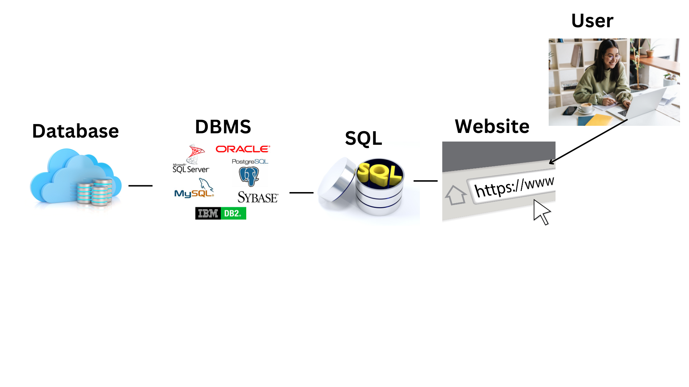

# What is Database?

A database is like a big library where you can store and find information.

Imagine you have a lot of books and you want to keep track of all of them, like the title, the author, and how many pages each book has. You could write this information down on pieces of paper and put them in a library. A database is like that, but it's on a computer and it can store much more information. It's like a digital library for all your important information.

### Database management System

If we think about our earlier example. Just like how a librarian helps you find the books you want and makes sure they are in the right place, the database management system helps you find the information you need and makes sure it is organized and easy to use. It also helps you add new information to the database, update or change information that is already there, and delete information that you don't need anymore. Think of it as a helper for your digital library to keep it neat and tidy.

### How SQL fits with the database management system (DBMS) and database (DB)?

SQL is a language that allows you to interact with the data stored in a database through a database management system (DBMS). DBMS is software that manages the database and uses SQL to communicate with it.

